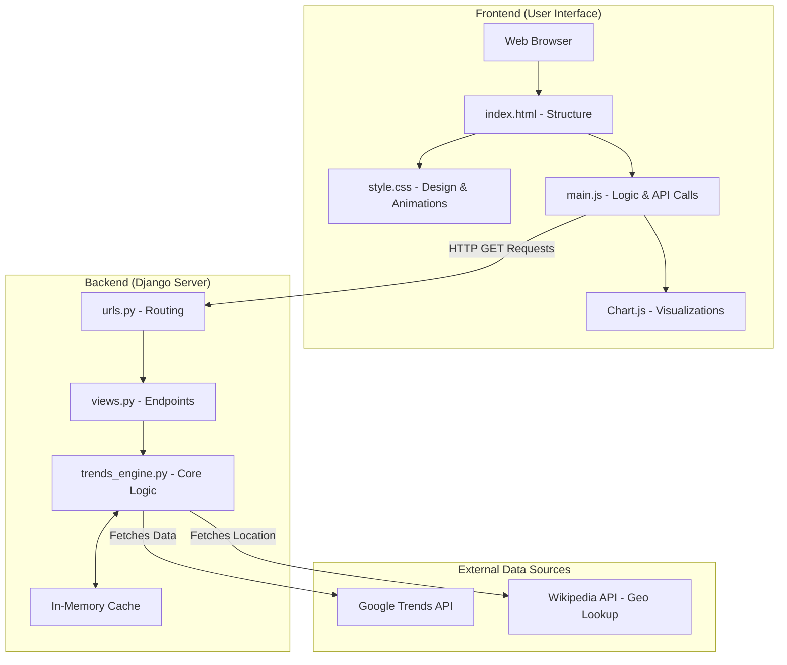
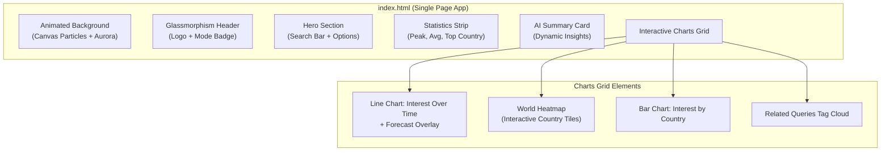
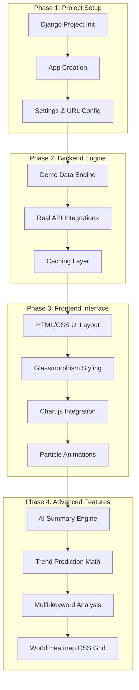

# TrendPulse — Google Trend Analyzer
## Complete Project Documentation

**Project Name:** TrendPulse
**Technology Stack:** Python (Django) + HTML/CSS/Vanilla JavaScript
**Architecture:** Monolithic MVC (Model-View-Template)
**Status:** Fully Functional (Demo + Live API Modes)

---

## 1. Project Overview

**TrendPulse** is a premium, full-stack web application designed to analyze Google Search Trends for any given keyword. It provides real-time trend intelligence, visualizes geographic interest, discovers related queries, compares multiple keywords, and predicts future trends.

### Key Features
- **Real-Time Data Analysis:** Analyzes search interest for any keyword over configurable time ranges.
- **Geographic Visualization:** Displays an interactive world heatmap of search interest across countries.
- **AI-Powered Insights:** Generates dynamic, natural-language trend summaries.
- **Trend Forecasting:** Uses linear regression algorithms to forecast future trend directions.
- **Premium User Interface:** Features a stunning dark-mode design with frosted glass effects (Glassmorphism) and a live particle animation background.

---

## 2. System Architecture

The project follows a standard **Client-Server Architecture** using the Model-View-Template (MVT) pattern.

### 2.1 High-Level Architecture Diagram



### 2.2 System Architecture Flow
1. The user types a keyword in the **Frontend** (Web Browser).
2. The **JavaScript (main.js)** sends an AJAX request to the **Backend** (Django).
3. The **Django Router (urls.py)** forwards the request to the correct **View (views.py)**.
4. The **Trends Engine (trends_engine.py)** processes the request, checks the **In-Memory Cache**, and fetches real data from **External APIs** (or uses the internal Demo Engine).
5. The processed data is sent back to the **Frontend** as a JSON response.
6. **Chart.js** takes this JSON data and draws the graphs dynamically on the screen.

---

## 3. Technology Stack & Tools Used

Here is a detailed breakdown of every tool used in this project, **where** it was used, and **why** it was chosen.

### Backend Technologies
*   **Python (Programming Language)** 
    *   *Where:* Entire backend codebase (`trends_engine.py`, `views.py`).
    *   *Why:* Fast, highly readable, and handles mathematical data processing efficiently.
*   **Django (Web Framework)**
    *   *Where:* Backend server foundation (`settings.py`, `urls.py`).
    *   *Why:* Provides a secure, scalable way to handle HTTP requests, route URLs, and serve the frontend application without complex boilerplate code.
*   **Requests Library (Python Package)**
    *   *Where:* `trends_engine.py`.
    *   *Why:* Used to execute HTTP GET requests to external APIs (RapidAPI, ScaleSerp, Wikipedia) to fetch live trend data.
*   **In-Memory Dictionary Caching**
    *   *Where:* `trends_engine.py` (Custom cache logic).
    *   *Why:* Temporarily stores API responses for 10 minutes to reduce redundant API calls, saving API credits and making the application load instantly for repeated searches.

### Frontend Technologies
*   **HTML5**
    *   *Where:* `index.html`.
    *   *Why:* Creates the semantic structure of the dashboard, search bars, and placeholders for the dynamic charts.
*   **Vanilla CSS3**
    *   *Where:* `style.css` (840+ lines).
    *   *Why:* Used to build a premium, modern dark-mode UI. It implements "Glassmorphism" (frosted glass effects) and handles advanced animations like the moving aurora background gradients.
*   **Vanilla JavaScript (ES6+)**
    *   *Where:* `main.js` (620+ lines).
    *   *Why:* Handles user interactions, executes asynchronous API calls to the Django backend using `fetch()`, and updates the HTML content dynamically without reloading the page.
*   **Chart.js (JavaScript Library)**
    *   *Where:* `main.js` and `index.html`.
    *   *Why:* Used to render the visual graphs, including Line Charts (Interest Over Time, Forecasts) and Bar Charts (Interest by Country).

### External APIs
*   **RapidAPI / ScaleSerp (Google Trends APIs)**
    *   *Where:* `trends_engine.py`.
    *   *Why:* The official Google Trends API does not have a public developer endpoint. These third-party APIs extract and structure real-time Google search data into JSON.
*   **Wikipedia API**
    *   *Where:* `trends_engine.py` (Geo-enrichment).
    *   *Why:* Used in the fallback demo mode to detect if a searched keyword is a specific place or person, automatically assigning accurate geographical data to the World Heatmap.

---

## 4. Project Directory Structure

```text
googletrend/
└── google_trend_django/                # Django Project Root
    ├── manage.py                       # Django CLI entry point
    ├── requirements.txt                # Python dependencies
    │
    ├── trendpulse/                     # Django Project Configuration
    │   ├── settings.py                 # App config, middleware, templates
    │   └── urls.py                     # Root URL routing
    │
    └── analyzer/                       # Main Django Application
        ├── views.py                    # 7 API endpoints + 1 page view
        ├── urls.py                     # Application URL routes
        ├── trends_engine.py            # Core logic & data processing (732 lines)
        │
        ├── templates/analyzer/
        │   └── index.html              # Main frontend view (273 lines)
        │
        └── static/analyzer/
            ├── css/style.css           # Premium dark UI styling (846 lines)
            └── js/main.js              # Frontend logic (624 lines)
```

---

## 5. Backend Engine Deep Dive

The heart of the application is `trends_engine.py`, which operates independently of a database to process data on the fly.

### API Endpoints Reference
1.  `/api/trends/` - Returns time-series data, peak interest, and forecasts.
2.  `/api/regions/` - Returns top countries and ISO codes for the heatmap.
3.  `/api/related/` - Returns top related search queries.
4.  `/api/compare/` - Returns dual time-series data for comparing two keywords.
5.  `/api/multi/` - Returns datasets for comparing up to 5 keywords.
6.  `/api/summary/` - Generates the AI-powered text summary.

### Core Engine Features
*   **Dual-Mode Architecture:** Seamlessly switches between an algorithmic Demo Mode (which uses math functions to simulate realistic data) and Real Mode (fetching live API data).
*   **Trend Prediction:** Uses **Simple Linear Regression** on the last 30% of data points to mathematically forecast future trend trajectories.
*   **AI Summary Engine:** Uses rule-based logical analysis to evaluate 5 dimensions (Trend Direction, Volatility, Peaks, Geo-distribution, and Context) to generate actionable insights.

---

## 6. Frontend UI Deep Dive

### 6.1 User Interface Structure Diagram



### 6.2 Key UI Features
*   **Particle System:** A custom Canvas 2D engine running in the background renders 60 moving particles with connecting proximity lines.
*   **World Heatmap:** A dynamically generated CSS grid that converts country names to ISO flag emojis and interpolates colors from red to green based on interest scores.
*   **Interactive Toggles:** Smooth CSS-only toggle switches allow the user to activate Keyword Comparison or Multi-Keyword analysis modes.

---

## 7. Step-by-Step Implementation Process



---

## 8. Detailed Technical Workflow (Example: Searching a Keyword)

To understand exactly how the project executes, here is the technical flow when a user searches for a keyword like **"Python"**:

1.  **User Action:** The user types "Python" into the search bar and clicks "Analyze".
2.  **JavaScript Request:** `main.js` catches the click event, shows a loading spinner, and fires **4 parallel asynchronous `fetch()` requests** to the Django backend:
    *   `/api/trends/?keyword=Python`
    *   `/api/regions/?keyword=Python`
    *   `/api/related/?keyword=Python`
    *   `/api/summary/?keyword=Python`
3.  **Django Routing:** Django's `urls.py` receives these requests and directs them to the appropriate functions in `views.py`.
4.  **Engine Processing:** `views.py` calls `trends_engine.py`. The engine checks if data for "Python" is already in the memory cache. 
    *   If yes, it returns the cached data instantly.
    *   If no, it contacts the Google Trends API (or uses the Demo Engine algorithm) to generate the data arrays.
    *   It applies the Linear Regression math to predict future points.
5.  **JSON Response:** The backend packages this data into a JSON dictionary and sends it back to the browser.
6.  **Data Visualization:** `main.js` receives the JSON. It passes the time-series data to Chart.js to draw the main line graph, passes the geographic data to Chart.js for the bar graph, and dynamically updates the HTML text for the AI Summary and Statistics Strip.
7.  **Completion:** The loading spinner hides, and the user sees the complete, interactive analytics dashboard.

---

## 9. Conclusion & File Metrics

The project successfully demonstrates a full-stack web application built using professional software engineering patterns. It operates seamlessly as a single Django server with no database dependencies, utilizing ~2,580 lines of custom code.

| File | Lines | Size | Purpose |
|------|-------|------|---------|
| `trends_engine.py` | 732 | 37 KB | Core business logic engine |
| `style.css` | 846 | 30 KB | Premium dark UI design system |
| `main.js` | 624 | 24 KB | Frontend logic & chart rendering |
| `index.html` | 273 | 15 KB | Single-page HTML template |
| `views.py` | 52 | 1.7 KB | Django API endpoints |
| **Total** | **~2,527** | **~107 KB** | **Complete Codebase** |

The combination of a robust Python backend, mathematical forecasting, and a visually stunning vanilla JavaScript frontend makes **TrendPulse** a highly effective and responsive data analysis platform.
